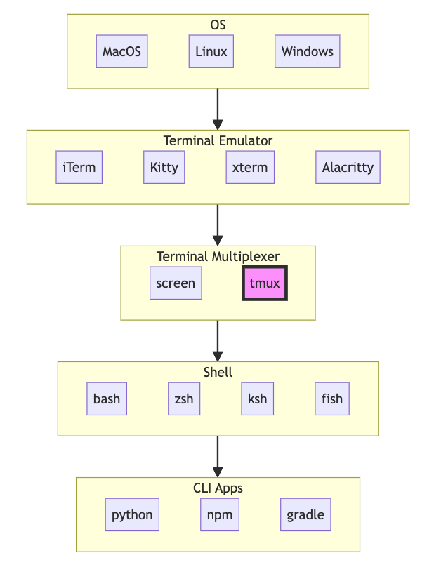
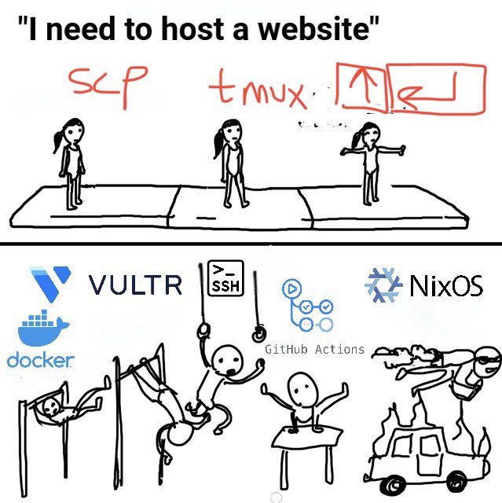
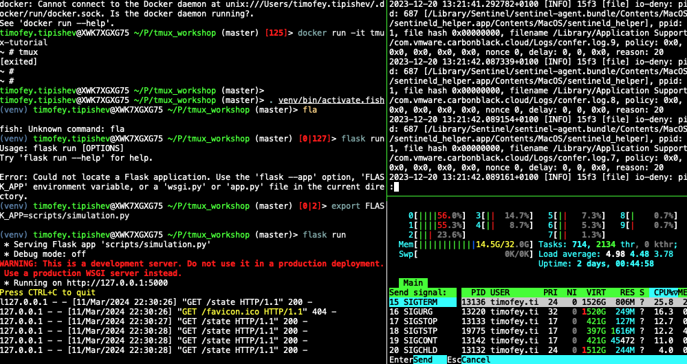
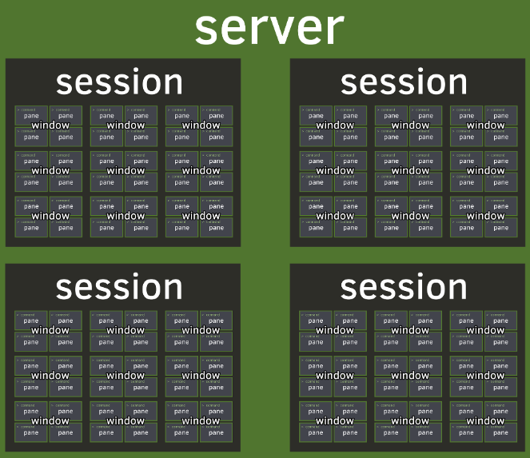

# tmux Workshop

# Transcript

## Introduction

Welcome to today's workshop. My name is Tim and I am a Competence Lead for Batch Variables. If you have been to my previous talks on Git, Python debuggers, and TiddlyWiki, you know that I am fascinated with tooling. I like to present tools that are not too big, but nevertheless useful. Today I will show how tmux can boost your productivity when working in terminal. I have been using tmux on and off for about 10 years and I prepared this workshop to share with you what I know. This session consists of 3 parts.

In the first part I will tell what tmux is, show the basic usage, and describe its architecture and core entities:

* Server,
* Clients,
* Sessions,
* Windows,
* and Panes

In the second part I will guide you through my well-documented configuration file that uses a lot of advanced features.

In the third part we will have a Q&A session and exchange tips on how to make tmux experience even better. If we run out of time, we will continue the exchange in #tmux channel on Slack.

## Part 1: Down the Memory Lane



Tmux is a short for terminal multiplexer. It is a command line tool that holds the state of one or more terminals. To put it simply, imagine running a command in a terminal, as soon as you close that terminal, the program receives a `SIGHUP` signal that makes it exit.

> open terminal.app, start python, close the terminal.

This is fine for running locally but becomes a problem when you SSH to a remote host, start a long-running command and the connection drops. To deal with this we need to spawn a proxy-process that persists the command's run state. I first encountered this problem back at university when I would miss on all the fun conversation on Computer Science Club IRC channel when I was offline since IRC did not keep history. At the time this was solved with a tool called GNU screen: I would SSH to the server, start screen, and run IRC client inside screen. When I reconnected to the server, screen was happily holding my chat client alive unless the server underwent a maintenance reboot. In one of these chat sessions my clubmate was excited about this new tool, tmux, which he described as screen on steroids, so we got it installed on the server.

This was THE use case for many people, as you can see even today in tmux's picture on Wikipedia:

> show [tmux Wikipedia page](https://en.wikipedia.org/wiki/tmux)

Later, I would shamefully use tmux to run my web servers instead of properly learning systemd. However, now that I look at all of today's complexity for hosting a website, I realize that it was not such a bad idea after all.



It is at that time I started learning about other features of tmux, my favorite was showing multiple split-terminals, called panes, at once. I would start the server in one split, open the logs in the other, and run `htop` in the third to show the server CPU and memory usage.



Now I realize that tmux gave me a service dashboard that took just 20 seconds to set up.

A little later, when I learned Vim and became obsessed with running everything in terminal, I started using tmux locally as my IDE and wanted to learn everything there was about it. This image from an online book [Tao of Tmux](https://tao-of-tmux.readthedocs.io/en/latest/index.html) (read it!) finally made it click for me:



Let's see this in action

> run `tmux -f /dev/null`

We use `-f /dev/null` to start tmux with the default configuration. 
By running this command we have created a server with one session
and a client attached to this session. 

At the moment this session contains just one window and one pane.

Let's give our session a name:

> `C-b $` give name "Klarna"

C-b combination is called the prefix, when you press it, tmux interprets the next keystroke as a shortcut to control its behavior. We will look at the most common shortcuts and later I'll show how to list them, change the default keybinding, and create your own.

Now let's enter

> `C-b ,`

To rename the window. And call it "first window".

To create the second window let's run

> `C-b c` and call it "second window"

We can switch between the window with prefix-1, prefix-2, etc.

> `C-b 1` `C-b 2` to go between numbered windows

We can subdivide windows into panes either vertically:

> `C-b %`

Or horizontally:

> `C-b "`

To move between panes we use prefix-arrow keys.

> `C-b &` to close a window, or just close the last pane with `Ctrl-D` and the window will close.

Now let's run a program in one of the panes and dettach from the session.

> `python3`
> `C-b d` # dettach

To reattach, we call `tmux -a`, short for attach. And we see that the 
Python shell is still running. This is the absolute minimum I want you to remember next time when it's 5:45 in the evening, you have a script chugging along on a remote server over SSH and you decide whether to leave the laptop at the office to finish the script over night.

Now, let's dettach again `C-b d` and start another session:

> * `tmux`
> * `C-b $` name it "Personal"

You can switch between sessions from the same terminal emulator with

> * `C-b w`

At this point you may realize, that one terminal is all you need. No need to bother your GUI with windows, tabs, and splits, tmux got you covered with sessions, windows, and panes.


If you like this idea, may I suggest Alacritty, a blazingly fast GPU-accelerated terminal written in Rust that does exactly this: forces a single window, zero tabs, and a dead-simle text configuration.

Now you may be saying, but what about my IDE? It also has a terminal. Tmux got you covered, too. Attaching to the a running session from IDE's terminal will create another client, connected to the same tmux session:

> `:list-clients`

The session is closed, when its last window is closed.

Whatever you do in one client is synchronized to every other. That's how my friend and I used to pair-play text-based adventures, we would both SSH to my server, start a Frotz client in tmux and take turns typing in commands, passing turns copilot-style: "You have control" -> "I have control".


# Part 3: Configuration

Now, let's close this ugly 

`cat /var/log/confer.log`

```
# 256 colors by default
set -g default-terminal "screen-256color"

# Set a C-a prefix, same as in GNU screen
unbind C-b
set -g prefix C-a
bind C-a send-prefix

# -v to echo what was read
bind-key -N "Reload config" R \
    source-file -v ~/.tmux.conf \; \
    display "Reloaded from ~/.tmux.conf"

# Window manager options

## because 0 is too far on the right
set -g base-index 1
set -g pane-base-index 1

## avoid holes in Window numbering
set-option -g renumber-windows on

## open Panes and Windows in the same directory as the current pane
bind '"' split-window -c "#{pane_current_path}"
bind % split-window -h -c "#{pane_current_path}"
bind c new-window -c "#{pane_current_path}"

# scrollback aka history

## 64K (lines) ought to be enough for anybody
set-option -g history-limit 64000

## enter copy mode on prefix-PageUp
## -e: exit copy-mode when scrolled to bottom
## -u: move 1 page up
bind PageUp copy-mode -eu

## save scrollback history to file on prefix-P
bind-key P command-prompt -p 'save history to filename:' -I '~/#{window_name}_%Y-%m-%d_tmux.history' 'capture-pane -S -32768 ; save-buffer %1 ; delete-buffer'

# Status bar customization
set -g status-interval 1  # refresh status every second

## left status
set -g status-left-length 90
set -g status-left "\
#[fg=green]#(whoami)\
#[fg=white]@\
#[fg=cyan]#(hostname -s)\
"

## center status
set -g status-justify centre
set -g status-bg black
set -g status-fg white

## right status
set -g status-right-length 60
set -g status-right "\
#{?mouse,🐀,}\
#{?pane_pipe,🔴,}\
#[fg=magenta]#{session_name}\
#[fg=white] %Y-%m-%d %H:%M:%S\
"

# Vimifying

## vim-keys for pane navigation
unbind-key j; bind-key j select-pane -D
unbind-key k; bind-key k select-pane -U
unbind-key h; bind-key h select-pane -L
unbind-key l; bind-key l select-pane -R

# needs more vim
set-window-option -g status-keys vi
set-window-option -g mode-keys vi
bind Escape copy-mode
bind-key -T copy-mode-vi 'v' send -X begin-selection
bind-key -T copy-mode-vi 'y' send -X copy-selection-and-cancel
unbind p; bind p paste-buffer
unbind n  # to be consistent with rebinding 'p', can I use it for next search result?
unbind ]  # y tho?

bind C-k resize-pane -U 1
bind C-j resize-pane -D 1
bind C-h resize-pane -L 1
bind C-l resize-pane -R 1

# Visuals

## make a clock green on prefix-T
set -g clock-mode-colour green

## visually appealing round popups
set -g popup-border-lines rounded

# Key bindings

## Silly popup widgets

bind-key -N "Display a fortune" F \
display-popup -E -w 80 -h 15 \
"fortune && read -n 1 -s -r"

bind-key -N "Display the caledar" C \
display-popup -E -x 999 -y 999 -w 22 -h 13 \
"cal -N && read -n 1 -s -r"

## Function Keys made useful
bind-key -T root -N "Toggle mouse" F3 \
set mouse

bind-key -T root -N "Toggle status bar" F4 \
set -g status

### Klarna shortcuts
bind-key -T root F5 \
display-menu -T "#[align=centre bg=#ffc0cb fg=black bold]Klarna" -x P -y P \
"AWS Login: DLT" d { send-keys "aws-login-tool login -a 426895431386 -r iam-sync/lakehouse-dlt/lakehouse-dlt.IdP_merchant-variables" Enter } \
"AWS Login: Playground" p { send-keys "aws-login-tool login -a 535232001183 -r iam-sync/merchant-variables/merchant-variables.IdP_admin" Enter }

## keep an audit log of a session
bind-key C-p \
  pipe-pane -o "cat >> ~/Desktop/tmux-log.#{session_name}-#{window_name}-#{pane_title}" \; \
  display-message "#{?pane_pipe,Started,Stopped} logging to ~/Desktop/tmux-log.#{session_name}-#{window_name}-#{pane_title}"
```

# Basic Usage
* for complete focus zoom with Z, hide status bar with `set -g status`
* show the time `t`

## Preset layouts

* `prefix-space`
* `display-panes`
* display-panes timeout + reload
* default: select-pane, change to kill pane, see `template` arg
* `main-pane-height`, `main-pane-width width`, `other-pane-height`, `other-pane-width`
* prefix-f to find the window: full-text search in what is shown in the pane.

## Config

* `-f some_tmux.conf` > `~/.tmux.conf` > `/etc/tmux.conf`
* config loaded once, errors are displayed but ignored, e.g. version change


# Usability
* `set synchronize-panes` for doing the same operation on multiple servers
* prefix: same everywhere, thus digging else `^b` for local `^a` for remote.

# Options
* on/off options can be toggled without specifiying `on`/`off`
* user options seem interesting, prefixed with `@`
* `cusomize-mode` to see all options

# Key Binding
* `list-keys` to see the default bindings
* `C-b ?` shows help
* C-b /       Describe key binding
* bind key to the root table, no need for prefix now you can finally put those silly function keys to use!
 - default root is quite bland, only mouse events with up to triple (!) mouse
* create your own table on top of existing four.

---
tmux tab-completion
---

# UI

## Status Line
* status line can be up to 5 lines tall
* status-interval default is 15 seconds, change to 1 second for faster refresh, e.g. show seconds in time
* Space left on disk, for those dockering around


### Building a widget

** prefix-/ to see the note
** prefix-? to see the list
** save key to tmux-config TODO how to paste from history?

## Menus

Let's take the most complex command from `list-keys`

`prefix->`


```
display-menu -T "#[align=centre]#{pane_index} (#{pane_id})" -x P -y P "#{?#{m/r:(copy|view)-mode,#{pane_mode}},Go To Top,
}" < { send-keys -X history-top } "#{?#{m/r:(copy|view)-mode,#{pane_mode}},Go To Bottom,}" > { send-keys -X history-bottom } '' "#{?mouse_word,Search For #[underscore]#{=
/9/...:mouse_word},}" C-r { if-shell -F "#{?#{m/r:(copy|view)-mode,#{pane_mode}},0,1}" "copy-mode -t=" ; send-keys -X -t = search-backward "#{q:mouse_word}" } "#{?mouse_w
ord,Type #[underscore]#{=/9/...:mouse_word},}" C-y { copy-mode -q ; send-keys -l "#{q:mouse_word}" } "#{?mouse_word,Copy #[underscore]#{=/9/...:mouse_word},}" c { copy-mo
de -q ; set-buffer "#{q:mouse_word}" } "#{?mouse_line,Copy Line,}" l { copy-mode -q ; set-buffer "#{q:mouse_line}" } '' "Horizontal Split" h { split-window -h } "Vertical
 Split" v { split-window -v } '' "#{?#{>:#{window_panes},1},,-}Swap Up" u { swap-pane -U } "#{?#{>:#{window_panes},1},,-}Swap Down" d { swap-pane -D } "#{?pane_marked_set
,,-}Swap Marked" s { swap-pane } '' Kill X { kill-pane } Respawn R { respawn-pane -k } "#{?pane_marked,Unmark,Mark}" m { select-pane -m } "#{?#{>:#{window_panes},1},,-}#{
?window_zoomed_flag,Unzoom,Zoom}" z { resize-pane -Z }
```

It demonstrate almost too many features of tmux.

### Klarna shortcuts

* starting name with `-` makes an item disabled
* add a `''` for a separator

## Borders
* pane-border-indicators [off | colour | arrows | both] is quite neat
* `popup-border-lines` rounded is cool

## Formats

* Conditionals: show mousy icon in my right status.
** regular expressions are supported when simple string comparison is not enough 
* Numeric operators: default integer/float optional
* `#{e|*|f|4:5.5,3}`  for a complicated calculator
* `#{a:64}` for ASCII lookup
* `#{c:turquoise}` for color to RGB hex code
* padding, truncating, substitution
* strftime
* run shell command, e.g. `#(whoami)`

## Styles #[...]

* fg=, bg=
** black, red, green, yellow, blue, magenta, cyan, white;
** brightred, brightgreen, brightyellow
** colour0 to colour255
** hex-code e.g. #ffffff
* align: left, center, right
* best way to play is in status line 


### Format Variables
* there are abbreviations for commonly used ones e.g. `#H` for `host`, `#S` for `session_name`.
* `display-message "#{cursor_character}"
---

# Copy Mode
* scrollback and search in history for error message

# Mouse Usage
* mouse right-click to select menu items
 - swap marked from mouse menu
** (Pane, Border, Status, Status, StatusLeft, StatusRight, StatusDefault) x (WheelUp/WheelDown, Down/Up/Drag, Double/Triple click) create your own crazy interface.
** {mouse} as the target for commands.
* Draw a table of possible events and their targets

# Bad (?) ideas
* cat own socket to break tmux
* Pomodoro in tmux?
* Pipe pane can be used also for input: `:pipe-pane -I "echo 'echo hello'"`
 - Funnily enough, both input and output can be enabled for pipe-pane. So, if you want to give some script both input and output access to your terminal, tmux can help you with that.

==========================

HERE BE DRAGONS

==========================

Status icon for background apps?

---
* `tmux list-sessions` -> `tmux ls`
* `Pr-w` for an interactive overview
* `Pr-f` for string search
* `Pr-&` end it all, with confirmation
* `Pr-%`, `Pr-"`, `Pr-o`, `Pr-arrows` for moving between splits
* `^<space>` for pre-set layouts

* `Pr-?` for current key-bindings, TODO run it


### Windows

* move with `.`, pro-tip: autonumber to allow moving to `0` and `99`  focus and tab-stack
* `f` search window for text
* `i` window info, too fast? use `~` to see tmux messages
* go to bell/activity `M-n` / `M-o`

### Panes

* resize with `C-arrows`, mega-resize with `M-arrows`, don't bother, use a mouse
* kill with `x`
* change layout with `C-space`
* rotate splits with `C-o`
* switch with `{`/`}`
* quick-switch in the same window `;` or `l`
* zoom on pane: `z`
* breakout `!` when a pane gets promoted to a window
* `q` display indexes and sizes
* `m` mark, `M` unmark

## Buffers

From the olden days of window point-and-click buffers were useful, so tmux improved on this and added multiple buffers.

* `[` enter copy mode, also with `PgUp`
* `]` paste
* `#` list paste buffers
* `=` choose what to paste
* `-` delete most recent paste buffer

## Commands

A whole new beast: `:`

Hello world: `display-message hello!`

Targeting with `-t` (target) and sometimes `-s` (source)

* `target-client`: /dev/ttyp1
* `target-session`: 4 rules
* `target-window`: 6 rules... and special symbols
* `target-pane`: special tokens, including relative positions and offsets

* if you have smuggled a mouse, use `{mouse}` to get target.
* `{marked}` can be also used

* sessions `$` , windows `@`, panes `%` have id, immutable, on server
  * `$TMUX`, `$TMUX_PANE`

  * `list-sessions`, `list-windows`, `list-panes`
  * `session_id`, `window_id`, or `pane_id` FORMATS
  * pass command to execute to
    - `new-window`
    - `new-session`
    - `split-window`
* `bind-key R source-file ~/.tmux.conf; display-message "config reloaded"`

* Group panes `join-pane -t :{window number}`


# Random Stuff

* (mouse events) x (areas) diagram
* `tmux lsp -F '#{session_id} #{window_id} #{pane_id}'`
* `[ -n "$TMUX" ] && echo inside tmux`

```
%if #{==:#{host_short},firsthost}
  source ~/.tmux.conf.firsthost
%elif #{==:#{host_short},secondhost}
  source ~/.tmux.conf.secondhost
%endif
```

* own key table
* choose-
* list-

# Links

* https://tmuxcheatsheet.com/
* https://habr.com/en/post/165437/
* https://pragprog.com/book/bhtmux2/tmux-2
* https://github.com/christoomey/vim-tmux-navigator
* https://iterm2.com/documentation-tmux-integration.html
